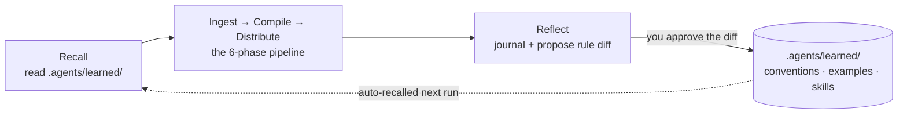

<div align="center">

<a href="https://github.com/Codex-Lab-Org"></a>

# Obsidian Knowledge Agent

**Talk to your Obsidian vault — it captures links, organizes your inbox, and builds course-grade notes on any subject, then learns your conventions and rewrites its own rules every run.**

[](https://github.com/Codex-Lab-Org)
[](#install)
[](#works-with-any-agent)
[](LICENSE)
[](https://github.com/Michael-OvO/obsidian-knowledge-agent)

</div>

---

Point any agentic assistant at your vault and just **talk to it** — *"save this link"*, *"organize my inbox"*, *"ingest the syllabus in Inbox"*. It reads how your vault is already organized, matches effort to the material, and writes notes that actually *teach* — one clean note for a quick capture, or a fully scaffolded collection with a concept-graph canvas for a whole course.

Then it does what a prompt-pack can't: **it reflects on each run and rewrites its own rules.** Every correction becomes a durable, reviewable lesson in your git history — applied automatically next time. No fine-tuning, no black box.

## Install

Two commands to add the plugin to your agent — the **same flow for Claude Code and OpenAI Codex**. Run the marketplace command first, then install.

**Claude Code**

```text
/plugin marketplace add Michael-OvO/obsidian-knowledge-agent
/plugin install obsidian-knowledge@obsidian-knowledge-agent
```

**OpenAI Codex**

```text
codex plugin marketplace add Michael-OvO/obsidian-knowledge-agent
codex plugin add obsidian-knowledge@obsidian-knowledge-agent
```

You get the ingestion skill, the **full `obsidian-knowledge` command suite** ([12 commands](#commands)), and the self-evolution hooks. Run `/obsidian-knowledge:help` anytime, or `:setup` to scaffold a vault from scratch.

<details>
<summary><b>Don't have Codex yet?</b></summary>

```bash
curl -fsSL https://chatgpt.com/codex/install.sh | sh   # macOS / Linux
npm install -g @openai/codex                           # …or npm
brew install --cask codex                              # …or Homebrew
```

Windows: `powershell -ExecutionPolicy ByPass -c "irm https://chatgpt.com/codex/install.ps1 | iex"` · or grab the [IDE extension](https://developers.openai.com/codex/ide).
</details>

Then seed a vault with the rule files + learning state (works with **any** agent):

```bash
curl -fsSL https://raw.githubusercontent.com/Michael-OvO/obsidian-knowledge-agent/main/install.sh | bash -s -- /path/to/your/vault
```

**First run:** say *"save this link"* for one clean note, or drop a syllabus into `Inbox/` and say *"organize my inbox"* — the agent picks the right altitude automatically. Don't like something it did? Run `reflect`, approve the proposed rule diff with `evolve`, and it won't repeat the mistake.

## What you can do

No rigid pipeline forced on every input. The agent picks the **altitude** that fits and escalates only when the material asks for it:

- **Capture** — a link, a thought, one article (*"save this"*) → one clean note, filed in the right place
- **Small collection** — a handful of related sources, a short topic → a few notes + a light index
- **Full build** — a syllabus, a book, a big paper set → the full scaffold: indexes, navigation, quality pass, concept-graph canvas

And it **fits the vault you're already in** — your folders, your naming, your frontmatter — instead of imposing a taxonomy. The academic branches (`School/`, `ML/`, `Quant/`) are just defaults for an empty vault; a work vault's `Projects/ Meetings/ People/` works just as well.

## Commands

In Claude Code, run `/obsidian-knowledge:help` for an in-tool guide (add a command name for detail, e.g. `/obsidian-knowledge:help research`). The full set — grouped:

**Start here**

- `/obsidian-knowledge:setup` — set this folder up as a vault: branches, learning state, dashboard, Inbox · _e.g._ `:setup ML, Quant, Research`
- `/obsidian-knowledge:help` — show everything the agent can do; `:help <command>` for detail · _e.g._ `:help research`

**Capture & build**

- `/obsidian-knowledge:capture` — save one quick, clean note in the right place · _e.g._ `:capture https://arxiv.org/abs/1706.03762`
- `/obsidian-knowledge:ingest` — build notes from `Inbox/` (or what you point at) at the right depth · _e.g._ `:ingest`
- `/obsidian-knowledge:research` — research a topic from the web and write teaching notes with sources · _e.g._ `:research how RoPE works`
- `/obsidian-knowledge:log` — append a timestamped line to today's daily log · _e.g._ `:log shipped the parser`

**Improve & maintain**

- `/obsidian-knowledge:polish` — improve existing notes in place (defaults to recently changed) · _e.g._ `:polish ML/Transformers`
- `/obsidian-knowledge:refactor` — reorganize safely and rewire every affected wikilink · _e.g._ `:refactor split the Transformers note`
- `/obsidian-knowledge:doctor` — health check: broken links, orphans, missing frontmatter · _e.g._ `:doctor`
- `/obsidian-knowledge:clean` — commit changed notes, clear processed Inbox (with approval), push · _e.g._ `:clean`

**Learn**

- `/obsidian-knowledge:reflect` — capture lessons from recent work; propose rule updates · _e.g._ `:reflect`
- `/obsidian-knowledge:evolve` — review and approve the agent's proposed rule changes · _e.g._ `:evolve`

**Try this first:** `:setup` → drop a source in `Inbox/` → `:ingest` → `:polish` → `:reflect`. Every command also works as plain English — *"research X"*, *"organize my inbox"*, *"check my vault for broken links"*.

## Why it's different — it self-evolves

Most "AI notes" tools run the same way forever. This one **compounds**: the more you use it, the more it matches *your* vault's taste.

It borrows the file-based learning model popularized by self-evolving agents like [Hermes](https://github.com/NousResearch/hermes-agent) — the agent rewrites its own markdown, never its weights — and specializes it for knowledge ingestion:



- **Your vault's conventions & style corrections** → `.agents/learned/conventions.md` — proposed as a **git diff you approve**
- **How to classify *your* kind of inputs** → `.agents/learned/examples.md` — few-shot, capped, recent-wins
- **Playbooks for brand-new source types** → `.agents/learned/skills/*.md` — one playbook per input shape
- **The full history of every run** → `.agents/learned/journal.md` — **append-only**, never rewritten

**Two-tier autonomy:** the journal is written freely; changes to the agent's *rules* are always surfaced as a diff for your approval — so it learns without quietly drifting. See [`.agents/self-evolution.md`](.agents/self-evolution.md) for the full loop and its drift-control rules.

👉 **See it learn:** [`examples/EVOLUTION.md`](examples/EVOLUTION.md) walks a real before/after — a correction becomes a rule, and the next run gets it right on its own.

## The method: recall → ingest → compile → distribute → reflect

- **Recall** (phase 0 · Step 0) — load `.agents/learned/`: apply learned conventions, few-shot examples, and matching playbooks.
- **Ingest** (phase 0) — classify the input (course / book / paper collection / single source / topic build), extract a structural map, resolve target paths.
- **Compile** (phases 1–3) — scaffold the folder tree + index files, write teaching-quality content/source/concept notes, build a concept-graph canvas.
- **Distribute** (phases 4–5) — wire prev/next navigation, validate every wikilink, run a parallel teaching-quality review.
- **Commit** (phase 6) — commit the collection; clear `Inbox/` under an explicit approval policy.
- **Reflect** (phase 7) — append a journal entry; propose durable rule/playbook updates for your review.

The pipeline lives in [`.agents/ingestion-workflow.md`](.agents/ingestion-workflow.md). Lighter captures and small collections run only the stages they need — see [**Choose the altitude**](.agents/ingestion-workflow.md#choose-the-altitude).

## What makes the notes good

- **Teaching-note style guide** ([`.agents/style-guide.md`](.agents/style-guide.md)) — notes read like something a human would revisit, with the machinery kept off-stage.
- **Artifacts that teach** — deep ML/Quant notes reach for a runnable code block, a LaTeX equation, and a Mermaid diagram where each genuinely helps understanding (and skip any that would just be filler).
- **Concept-graph canvas** — collections with 3+ units get a [JSON-Canvas](https://jsoncanvas.org/) map linking each concept to the units where it appears.
- **Link integrity** — a real Python validator ([`validate_links.py`](plugins/obsidian-knowledge/scripts/validate_links.py)) flags broken wikilinks before commit — resolving image/PDF embeds, block (`^`) and heading (`#`) anchors, and aliases the way Obsidian does, and ignoring links inside code. Runs in the pipeline and in CI.
- **Parallel workers** — note-writing and the quality pass fan out across multiple agents.

## Works with any agent

The pipeline is defined in plain markdown (`AGENTS.md` + `.agents/`), so it runs in **Claude Code, Codex, Cursor, or any agent that reads `AGENTS.md`** — the self-evolution loop included (the hooks are a convenience, not a requirement).

```bash
# Into an Obsidian vault (AGENTS.md + .agents/ + a seeded .agents/learned/ + Inbox/)
curl -fsSL https://raw.githubusercontent.com/Michael-OvO/obsidian-knowledge-agent/main/install.sh | bash -s -- /path/to/your/vault

# As a bare skill (into ~/.claude/skills/)
curl -fsSL https://raw.githubusercontent.com/Michael-OvO/obsidian-knowledge-agent/main/install.sh | bash -s -- --skill

# Both at once
curl -fsSL https://raw.githubusercontent.com/Michael-OvO/obsidian-knowledge-agent/main/install.sh | bash -s -- --both /path/to/your/vault
```

<details>
<summary>From a clone instead</summary>

```bash
git clone https://github.com/Michael-OvO/obsidian-knowledge-agent
cd obsidian-knowledge-agent
./install.sh /path/to/your/vault     # vault files + learning state
./install.sh --skill                 # bare skill
./install.sh --both /path/to/vault   # both
```
</details>

## Repo layout

```text
obsidian-knowledge-agent/              # one repo, a Claude Code AND Codex marketplace
├── .claude-plugin/marketplace.json    # Claude Code marketplace manifest
├── .agents/plugins/marketplace.json   # Codex marketplace manifest
├── plugins/obsidian-knowledge/        # the plugin
│   ├── .claude-plugin/plugin.json     # Claude plugin manifest
│   ├── .codex-plugin/plugin.json      # Codex plugin manifest (marketplace card)
│   ├── skills/obsidian-knowledge/     # the ingestion skill (+ synced references/)
│   ├── commands/                      # ingest · reflect · evolve
│   ├── hooks/hooks.json               # SessionStart recall + Stop reflect-nudge
│   └── scripts/                       # recall.sh · reflect-nudge.sh · validate_links.py
├── AGENTS.md + .agents/               # tool-agnostic source of truth (any agent)
│   └── self-evolution.md              # the learning loop
├── examples/                          # worked run + EVOLUTION.md before/after demo
└── install.sh                         # one-line installer for vaults & the skill
```

`.agents/` is the single source of truth; [`scripts/sync-skill.sh`](scripts/sync-skill.sh) mirrors it into the plugin's skill references.

## Customize

- **Branches:** edit the branch table in `AGENTS.md` and `.agents/vault-architecture.md` to match your domains.
- **Style:** tune `.agents/style-guide.md` (e.g., change which artifacts technical notes reach for, or the default note shapes) for your subjects.
- **Conventions:** frontmatter, naming, math, and canvas rules live in `.agents/obsidian-conventions.md`.
- **What it has learned:** read or prune `.agents/learned/` anytime — it's just markdown.

## Contributing

Issues and PRs welcome — see [`CONTRIBUTING.md`](CONTRIBUTING.md). CI validates the plugin/marketplace manifests and runs the link checker on every PR.

## Part of Codex Lab

This project is part of **[Codex Lab](https://github.com/Codex-Lab-Org)**. Explore the rest of the lab's projects on [GitHub](https://github.com/Codex-Lab-Org).

[](https://github.com/Codex-Lab-Org)

## License

MIT — see [LICENSE](LICENSE).
