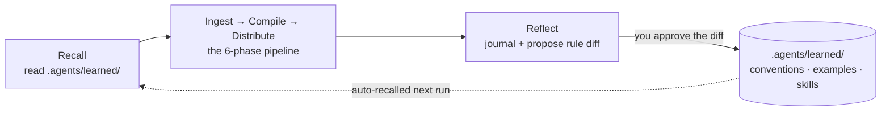

<div align="center">

# Obsidian Knowledge Agent

**A self-evolving knowledge agent for Obsidian — from a one-line capture to a full course build. Any subject, any vault. It does as much (or as little) structuring as the material needs, and learns your conventions from every run.**

[](LICENSE)
[](#install)
[](#works-with-any-agent)
[](https://github.com/Michael-OvO/obsidian-knowledge-agent)

</div>

---

Point any agentic coding assistant at your vault and talk to it naturally — *"save this link"*, *"make a note on X"*, *"organize my inbox"*, or *"ingest the syllabus in Inbox"*. It reads how your vault is already organized, matches the effort to the material, and writes notes that actually *teach* — a single clean note for a quick capture, or a fully scaffolded collection with a concept-graph canvas for a whole course. It works for any subject: coursework, research, work projects, reading, personal knowledge.

Then it does something a prompt-pack can't: **it reflects on the run and improves its own rules.** Every correction you make becomes a durable, reviewable lesson — captured as plain markdown in your git history and applied automatically next time. No fine-tuning, no black box.

## Does as much — or as little — as you need

No rigid pipeline forced on every input. The agent picks the **altitude** that fits and escalates only when the material asks for it:

| Altitude | For | What you get |
|---|---|---|
| **Capture** | a link, a thought, one article — *"save this"* | one clean note, filed in the right place |
| **Small collection** | a handful of related sources, a short topic | a few notes + a light index |
| **Full build** | a syllabus, a book, a big paper set | the full scaffold: indexes, navigation, quality pass, concept-graph canvas |

And it **fits the vault you're already in** — your folders, your naming, your frontmatter — instead of imposing a taxonomy. The academic branches (`School/`, `ML/`, `Quant/`) are just defaults for an empty vault; a work vault's `Projects/ Meetings/ People/` works just as well.

## Why it's different — it self-evolves

Most "AI notes" tools run the same way forever. This one **compounds**: the more you use it, the more it matches *your* vault's taste.

It borrows the file-based learning model popularized by self-evolving agents like [Hermes](https://github.com/NousResearch/hermes-agent) — the agent rewrites its own markdown, never its weights — and specializes it for knowledge ingestion:



| What it learns | Where it's stored | How it's kept safe |
|---|---|---|
| Your vault's conventions & style corrections | `.agents/learned/conventions.md` | Proposed as a **git diff you approve** |
| How to classify *your* kind of inputs | `.agents/learned/examples.md` | Few-shot, capped, recent-wins |
| Playbooks for brand-new source types | `.agents/learned/skills/*.md` | One playbook per input shape |
| The full history of every run | `.agents/learned/journal.md` | **Append-only**, never rewritten |

**Two-tier autonomy:** the journal is written freely; changes to the agent's *rules* are always surfaced as a diff for your approval — so it learns without quietly drifting. See [`.agents/self-evolution.md`](.agents/self-evolution.md) for the full loop and its drift-control rules.

👉 **See it learn:** [`examples/EVOLUTION.md`](examples/EVOLUTION.md) walks a real before/after — a correction becomes a rule, and the next run gets it right on its own.

## Install

### As a Claude Code plugin (recommended)

Get the skill, the `/obsidian-knowledge:*` commands, and the self-evolution hooks in one step:

```text
/plugin marketplace add Michael-OvO/obsidian-knowledge-agent
/plugin install obsidian-knowledge@obsidian-knowledge-agent
```

Then seed a vault with the tool-agnostic rule files + learning state:

```bash
curl -fsSL https://raw.githubusercontent.com/Michael-OvO/obsidian-knowledge-agent/main/install.sh | bash -s -- /path/to/your/vault
```

### Works with any agent

The pipeline is defined in plain markdown (`AGENTS.md` + `.agents/`), so it runs in **Codex, Cursor, or any agent that reads `AGENTS.md`** — the self-evolution loop included (the hooks are a Claude Code convenience, not a requirement).

```bash
# Into an Obsidian vault (AGENTS.md + .agents/ + a seeded .agents/learned/ + Inbox/)
curl -fsSL https://raw.githubusercontent.com/Michael-OvO/obsidian-knowledge-agent/main/install.sh | bash -s -- /path/to/your/vault

# As a bare Claude Code skill (into ~/.claude/skills/)
curl -fsSL https://raw.githubusercontent.com/Michael-OvO/obsidian-knowledge-agent/main/install.sh | bash -s -- --skill

# Both at once
curl -fsSL https://raw.githubusercontent.com/Michael-OvO/obsidian-knowledge-agent/main/install.sh | bash -s -- --both /path/to/your/vault
```

<details>
<summary>From a clone instead</summary>

```bash
git clone https://github.com/Michael-OvO/obsidian-knowledge-agent
cd obsidian-knowledge-agent
./install.sh /path/to/your/vault     # vault files + learning state
./install.sh --skill                 # Claude Code skill
./install.sh --both /path/to/vault   # both
```
</details>

## Quickstart

1. Install (above).
2. **Capture something small:** say *"save this link"* or run `/obsidian-knowledge:capture <url>` — you get one clean note, filed in the right folder.
3. **Or ingest something bigger:** drop a syllabus, paper set, or book TOC into `Inbox/` and say *"organize my inbox"* or run `/obsidian-knowledge:ingest`. The agent picks the right altitude automatically.
4. Review what it made, then approve clearing `Inbox/` if relevant.
5. Correct anything you don't like. Run `/obsidian-knowledge:reflect`, approve the proposed rule diff with `/obsidian-knowledge:evolve`, and the agent won't make that mistake again.

## The method: recall → ingest → compile → distribute → reflect

| Stage | Phases | What happens |
|---|---|---|
| **Recall** | 0 · Step 0 | Load `.agents/learned/` — apply learned conventions, few-shot examples, and matching playbooks. |
| **Ingest** | 0 | Classify the input (course / book / paper collection / single source / topic build), extract a structural map, resolve target paths. |
| **Compile** | 1–3 | Scaffold the folder tree + index files, write teaching-quality content/source/concept notes, build a concept-graph canvas. |
| **Distribute** | 4–5 | Wire prev/next navigation, validate every wikilink, run a parallel teaching-quality review. |
| **Commit** | 6 | Commit the collection; clear `Inbox/` under an explicit approval policy. |
| **Reflect** | 7 | Append a journal entry; propose durable rule/playbook updates for your review. |

The pipeline lives in [`.agents/ingestion-workflow.md`](.agents/ingestion-workflow.md). Lighter captures and small collections run only the stages they need — see [**Choose the altitude**](.agents/ingestion-workflow.md#choose-the-altitude).

## What makes the notes good

- **Teaching-note style guide** ([`.agents/style-guide.md`](.agents/style-guide.md)) — notes read like something a human would revisit, with the machinery kept off-stage.
- **Artifacts that teach** — deep ML/Quant notes reach for a runnable code block, a LaTeX equation, and a Mermaid diagram where each genuinely helps understanding (and skip any that would just be filler).
- **Concept-graph canvas** — collections with 3+ units get a [JSON-Canvas](https://jsoncanvas.org/) map linking each concept to the units where it appears.
- **Link integrity** — a real Python validator ([`validate_links.py`](plugins/obsidian-knowledge/scripts/validate_links.py)) flags broken wikilinks before commit — resolving image/PDF embeds, block (`^`) and heading (`#`) anchors, and aliases the way Obsidian does, and ignoring links inside code. Runs in the pipeline and in CI.
- **Parallel workers** — note-writing and the quality pass fan out across multiple agents.

## Repo layout

```text
obsidian-knowledge-agent/              # this repo IS a Claude Code marketplace
├── .claude-plugin/marketplace.json    # marketplace manifest
├── plugins/obsidian-knowledge/        # the plugin
│   ├── .claude-plugin/plugin.json
│   ├── skills/obsidian-knowledge/     # the ingestion skill (+ synced references/)
│   ├── commands/                      # /obsidian-knowledge: ingest · reflect · evolve
│   ├── hooks/hooks.json               # SessionStart recall + Stop reflect-nudge
│   └── scripts/                       # recall.sh · reflect-nudge.sh · validate_links.py
├── AGENTS.md + .agents/               # tool-agnostic source of truth (Codex/Cursor)
│   └── self-evolution.md              # the learning loop
├── examples/                          # worked run + EVOLUTION.md before/after demo
└── install.sh                         # one-line installer for vaults & the skill
```

`.agents/` is the single source of truth; [`scripts/sync-skill.sh`](scripts/sync-skill.sh) mirrors it into the plugin's skill references.

## Customize

- **Branches:** edit the branch table in `AGENTS.md` and `.agents/vault-architecture.md` to match your domains.
- **Style:** tune `.agents/style-guide.md` (e.g., change which artifacts technical notes reach for, or the default note shapes) for your subjects.
- **Conventions:** frontmatter, naming, math, and canvas rules live in `.agents/obsidian-conventions.md`.
- **What it has learned:** read or prune `.agents/learned/` anytime — it's just markdown.

## Contributing

Issues and PRs welcome — see [`CONTRIBUTING.md`](CONTRIBUTING.md). CI validates the plugin/marketplace manifests and runs the link checker on every PR.

## License

MIT — see [LICENSE](LICENSE).
