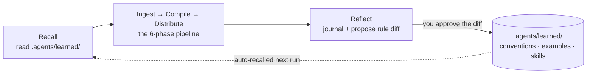

<div align="center">

<a href="https://github.com/Codex-Lab-Org"></a>

# Obsidian Knowledge Agent

**Talk to your vault. It does the rest.**

You drop it in. It files, it teaches, and it remembers how you like your notes.

[](https://github.com/Codex-Lab-Org)
[](#install)
[](#works-with-any-agent)
[](LICENSE)
[](https://github.com/Michael-OvO/obsidian-knowledge-agent)

</div>

---

Point any agentic assistant at your Obsidian vault and **talk to it** — *"save this link"*, *"organize my inbox"*, *"ingest the syllabus in Inbox"*. It reads how your vault is already organized, matches effort to the material, and writes notes that actually *teach*: a clean one-liner for a quick save, or a fully scaffolded collection with a concept-graph canvas for a whole course.

Then it does what a prompt-pack can't: **it reflects on every run and rewrites its own rules.** Each correction you make becomes a durable, reviewable lesson in your git history — applied automatically next time. No fine-tuning. No black box.

## Before / after

You ask your agent to *"make notes on this paper."* It writes a flat summary to `notes.md` at the repo root, picks a filename you'll never find again, and moves on.

With the agent:

```text
# you: "save this"
ML/Papers/Attention Is All You Need.md                  ← filed, not dumped
tags: [transformers, attention]                         ← your frontmatter, matched
see also: [[Self-Attention]], [[Positional Encoding]]   ← wired into what you know
```

A teaching-grade note in your vault's own conventions — the key equation in LaTeX, a runnable block, a diagram where each genuinely helps. And the next correction you make becomes a rule it keeps.

More in [`examples/`](examples/).

## Install

The most effort it'll ever ask of you. **Same two-command flow for Claude Code and OpenAI Codex** — add the marketplace, then install.

**Claude Code**

```text
/plugin marketplace add Michael-OvO/obsidian-knowledge-agent
```

```text
/plugin install obsidian-knowledge@obsidian-knowledge-agent
```

**OpenAI Codex**

```text
codex plugin marketplace add Michael-OvO/obsidian-knowledge-agent
```

```text
codex plugin add obsidian-knowledge@obsidian-knowledge-agent
```

You get the ingestion skill, all [12 commands](#commands), and the self-evolution hooks. Then run `/obsidian-knowledge:setup` in your vault — **empty folder or an existing vault, it adapts** — or just start talking to it.

<details>
<summary><b>Don't have Codex yet?</b></summary>

```bash
curl -fsSL https://chatgpt.com/codex/install.sh | sh   # macOS / Linux
npm install -g @openai/codex                           # …or npm
brew install --cask codex                              # …or Homebrew
```

Windows: `powershell -ExecutionPolicy ByPass -c "irm https://chatgpt.com/codex/install.ps1 | iex"` · or grab the [IDE extension](https://developers.openai.com/codex/ide).
</details>

Prefer no plugin? Seed any folder with the rule files + learning state — works with **any** agent:

```bash
curl -fsSL https://raw.githubusercontent.com/Michael-OvO/obsidian-knowledge-agent/main/install.sh | bash -s -- /path/to/your/vault
```

**First run:** say *"save this link"* for one clean note, or drop a syllabus into `Inbox/` and say *"organize my inbox"*. Don't like what it did? Run `reflect`, approve the rule diff with `evolve`, and it won't repeat the mistake.

## How it works — it picks the altitude

No rigid pipeline forced on every input. Before it writes, it stops at the altitude that fits the material:

```text
1. A link or a thought       → one clean note, filed in the right place
2. A handful of sources      → a few notes + a light index
3. A whole syllabus or book  → the full scaffold: indexes, navigation,
                               a quality pass, and a concept-graph canvas
```

It escalates only when the material asks for it — and it **fits the vault you're already in** (your folders, your naming, your frontmatter) instead of imposing a taxonomy. The academic branches (`School/`, `ML/`, `Quant/`) are just defaults for an empty vault; a work vault's `Projects/ Meetings/ People/` works just as well.

## Commands

You rarely need these — just talk to it (*"research X"*, *"organize my inbox"*, *"check my vault for broken links"*). But when you want a command, here's the set. Run `/obsidian-knowledge:help` for an in-tool guide, or `:help <command>` for detail.

| Command | What it does |
| --- | --- |
| `/obsidian-knowledge:setup [domains]` | Set this folder up as a vault — **adapts to an empty folder or an existing vault**. |
| `/obsidian-knowledge:capture <thing>` | Save one quick, clean note in the right place. |
| `/obsidian-knowledge:ingest [what]` | Build notes from `Inbox/` (or what you point at) at the right altitude. |
| `/obsidian-knowledge:research <topic>` | Research a topic from the web and write teaching notes with sources. |
| `/obsidian-knowledge:log <text>` | Append a timestamped line to today's daily log. |
| `/obsidian-knowledge:polish [note]` | Improve existing notes in place (defaults to recently changed). |
| `/obsidian-knowledge:refactor <change>` | Reorganize safely and rewire every affected wikilink. |
| `/obsidian-knowledge:doctor [folder]` | Health check: broken links, orphans, missing frontmatter. |
| `/obsidian-knowledge:clean [message]` | Commit changed notes, clear processed Inbox (with approval), push. |
| `/obsidian-knowledge:reflect` | Capture lessons from recent work and propose rule updates. |
| `/obsidian-knowledge:evolve` | Review and approve the agent's proposed rule changes. |
| `/obsidian-knowledge:help [command]` | Show everything the agent can do; add a name for detail. |

**Try this first:** `setup` → drop a source in `Inbox/` → `ingest` → `polish` → `reflect`.

## Why it's different — it self-evolves

Most "AI notes" tools run the same way forever. This one **compounds**: the more you use it, the more it matches *your* vault's taste.

It borrows the file-based learning model from self-evolving agents like [Hermes](https://github.com/NousResearch/hermes-agent) — the agent rewrites its own markdown, never its weights — and specializes it for knowledge ingestion:



- **Your conventions & style corrections** → `.agents/learned/conventions.md`, proposed as a **git diff you approve**.
- **How to classify *your* kind of inputs** → `.agents/learned/examples.md` — few-shot, capped, recent-wins.
- **Playbooks for brand-new source types** → `.agents/learned/skills/*.md` — one per input shape.
- **The full run history** → `.agents/learned/journal.md` — **append-only**, never rewritten.

**Two-tier autonomy:** the journal is written freely; changes to the agent's *rules* are always surfaced as a diff for your approval — so it learns without quietly drifting. See [`.agents/self-evolution.md`](.agents/self-evolution.md) for the full loop.

👉 **See it learn:** [`examples/EVOLUTION.md`](examples/EVOLUTION.md) walks a real before/after — a correction becomes a rule, and the next run gets it right on its own. Your vault gets sharper every time you use it. That's the whole idea.

## What makes the notes good

- **Teaching-note style** ([`.agents/style-guide.md`](.agents/style-guide.md)) — notes read like something you'd revisit, with the machinery kept off-stage.
- **Artifacts that teach** — deep notes reach for a runnable code block, a LaTeX equation, or a Mermaid diagram where each genuinely helps (and skip the filler).
- **Concept-graph canvas** — collections of 3+ units get a [JSON-Canvas](https://jsoncanvas.org/) map linking each concept to the units where it appears.
- **Link integrity** — a real [link validator](plugins/obsidian-knowledge/scripts/validate_links.py) flags broken wikilinks before commit, resolving image/PDF embeds, block (`^`) and heading (`#`) anchors, and aliases the way Obsidian does, and ignoring links inside code. Runs in the pipeline and in CI.
- **Parallel workers** — note-writing and the quality pass fan out across multiple agents.

The full pipeline (recall → ingest → compile → distribute → reflect) lives in [`.agents/ingestion-workflow.md`](.agents/ingestion-workflow.md). Lighter captures run only the stages they need.

## Works with any agent

The whole pipeline is plain markdown (`AGENTS.md` + `.agents/`), so it runs in **Claude Code, Codex, Cursor, or any agent that reads `AGENTS.md`** — self-evolution included (the hooks are a convenience, not a requirement).

```bash
# Into an Obsidian vault (AGENTS.md + .agents/ + a seeded .agents/learned/ + Inbox/)
curl -fsSL https://raw.githubusercontent.com/Michael-OvO/obsidian-knowledge-agent/main/install.sh | bash -s -- /path/to/your/vault

# As a bare skill (into ~/.claude/skills/)
curl -fsSL https://raw.githubusercontent.com/Michael-OvO/obsidian-knowledge-agent/main/install.sh | bash -s -- --skill

# Both at once
curl -fsSL https://raw.githubusercontent.com/Michael-OvO/obsidian-knowledge-agent/main/install.sh | bash -s -- --both /path/to/your/vault
```

<details>
<summary>From a clone instead</summary>

```bash
git clone https://github.com/Michael-OvO/obsidian-knowledge-agent
cd obsidian-knowledge-agent
./install.sh /path/to/your/vault     # vault files + learning state
./install.sh --skill                 # bare skill
./install.sh --both /path/to/vault   # both
```
</details>

## FAQ

**Will it touch my existing notes?** Only with your approval. It reads your vault before it writes, and clears the `Inbox/` only when you say so.

**I already have a big vault — do I start over?** No. `setup` adapts: it reads your existing folders, naming, and frontmatter, imposes nothing, and fills only the gaps (learning state, an `Inbox/`, a dashboard).

**Does it need a config file?** No. Drop in the plugin (or the rule files) and talk to it.

**Does it work without the plugin?** Yes — it's just markdown (`AGENTS.md` + `.agents/`). The plugin only adds the commands and the recall/reflect hooks.

**What if it gets my taste wrong?** Run `reflect`, approve the rule diff with `evolve`, and it won't repeat the mistake.

## Repo layout

```text
obsidian-knowledge-agent/              # one repo, a Claude Code AND Codex marketplace
├── .claude-plugin/marketplace.json    # Claude Code marketplace manifest
├── .agents/plugins/marketplace.json   # Codex marketplace manifest
├── plugins/obsidian-knowledge/        # the plugin
│   ├── .claude-plugin/plugin.json     # Claude plugin manifest
│   ├── .codex-plugin/plugin.json      # Codex plugin manifest (marketplace card)
│   ├── skills/obsidian-knowledge/     # the ingestion skill (+ synced references/)
│   ├── commands/                      # the 12-command suite
│   ├── hooks/hooks.json               # SessionStart recall + Stop reflect-nudge
│   └── scripts/                       # recall.sh · reflect-nudge.sh · validate_links.py
├── AGENTS.md + .agents/               # tool-agnostic source of truth (any agent)
│   └── self-evolution.md              # the learning loop
├── examples/                          # worked run + EVOLUTION.md before/after demo
└── install.sh                         # one-line installer for vaults & the skill
```

`.agents/` is the single source of truth; [`scripts/sync-skill.sh`](scripts/sync-skill.sh) mirrors it into the plugin's skill references.

## Customize

- **Branches:** edit the branch table in `AGENTS.md` and `.agents/vault-architecture.md` to match your domains.
- **Style:** tune `.agents/style-guide.md` (which artifacts technical notes reach for, the default note shapes) for your subjects.
- **Conventions:** frontmatter, naming, math, and canvas rules live in `.agents/obsidian-conventions.md`.
- **What it has learned:** read or prune `.agents/learned/` anytime — it's just markdown.

## Contributing

Issues and PRs welcome — see [`CONTRIBUTING.md`](CONTRIBUTING.md). CI validates the plugin/marketplace manifests and runs the link checker on every PR.

## Part of Codex Lab

This project is part of **[Codex Lab](https://github.com/Codex-Lab-Org)** — explore the rest of the lab on [GitHub](https://github.com/Codex-Lab-Org).

## License

MIT — see [LICENSE](LICENSE).
