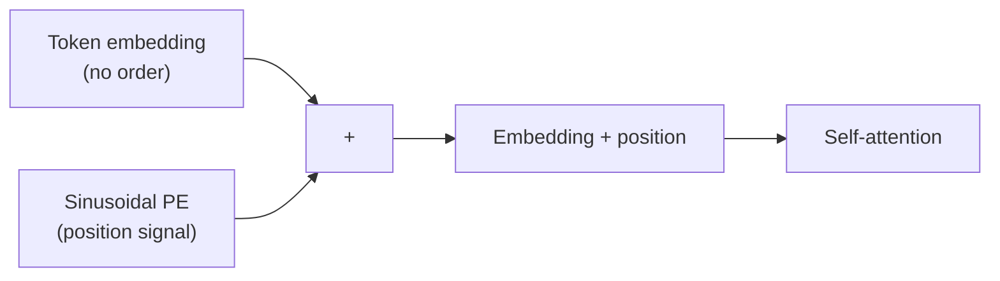

# Sinusoidal Positional Encoding

## The Question

Self-attention treats its inputs as a *set*: permute the tokens and the output permutes with them, otherwise unchanged. So how does a transformer tell "dog bites man" from "man bites dog"?

## Core Idea

Add a position-dependent vector to each token embedding *before* attention, so the model sees content and position together. Vaswani et al. (2017) use fixed sinusoids of geometrically increasing wavelength, so each dimension encodes position at a different frequency.

## The Math

For position $pos$ and dimension $i$ in a model of width $d_\text{model}$:

$$
PE_{(pos,\,2i)} = \sin\!\left(\frac{pos}{10000^{2i/d_\text{model}}}\right), \qquad
PE_{(pos,\,2i+1)} = \cos\!\left(\frac{pos}{10000^{2i/d_\text{model}}}\right)
$$

Low dimensions oscillate quickly (fine-grained position); high dimensions oscillate slowly (coarse position). Because $PE_{pos+k}$ is a linear function of $PE_{pos}$, relative offsets are easy for attention to exploit.

## Code

```python
import numpy as np

def sinusoidal_encoding(seq_len: int, d_model: int) -> np.ndarray:
    pos = np.arange(seq_len)[:, None]                 # (seq_len, 1)
    i = np.arange(d_model)[None, :]                   # (1, d_model)
    angle = pos / np.power(10000, (2 * (i // 2)) / d_model)
    pe = np.zeros((seq_len, d_model))
    pe[:, 0::2] = np.sin(angle[:, 0::2])              # even dims -> sin
    pe[:, 1::2] = np.cos(angle[:, 1::2])              # odd dims  -> cos
    return pe

if __name__ == "__main__":
    pe = sinusoidal_encoding(seq_len=50, d_model=128)
    print(pe.shape)  # (50, 128)
```

## Diagram



## Tradeoffs

- **Sinusoidal (fixed):** no parameters; extrapolates past training lengths.
- **Learned absolute:** one trainable vector per slot — flexible, but capped at the max trained length.
- **Relative / rotary (RoPE):** encode the *offset* between positions rather than absolute slots; now standard in many LLMs.

## Related Notes

- [[ML/Positional Encoding/References/Positional Encoding\|Positional Encoding]] — the shared concept this note instantiates.
